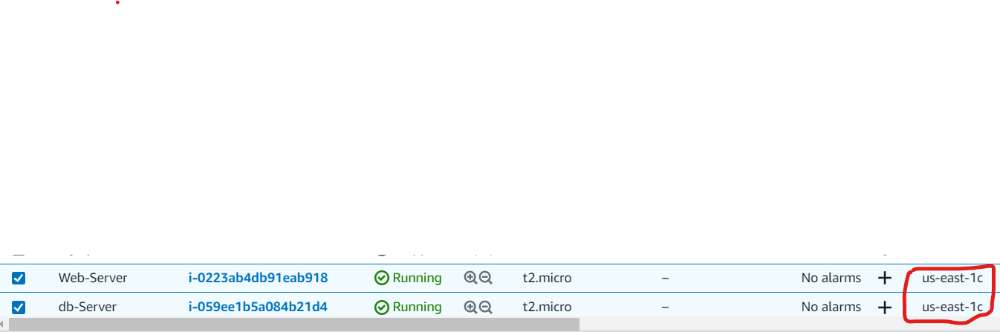
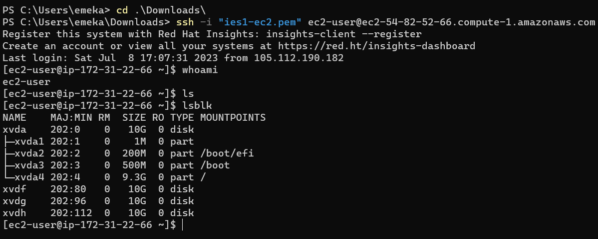
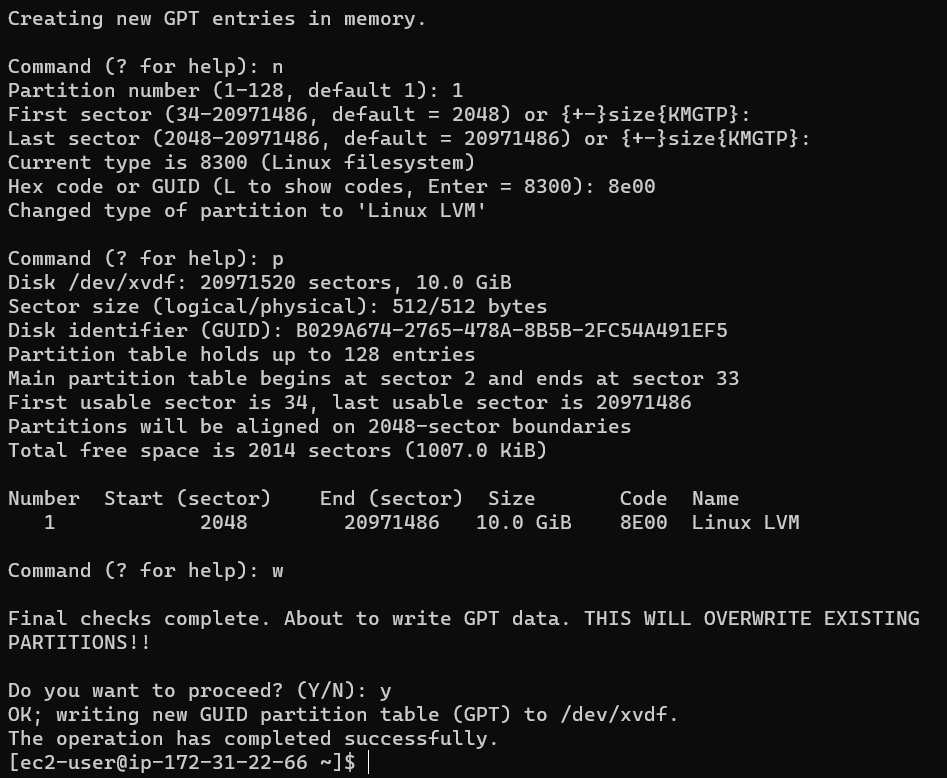
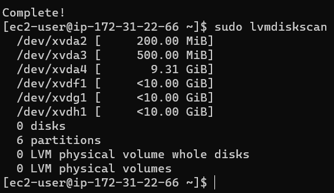
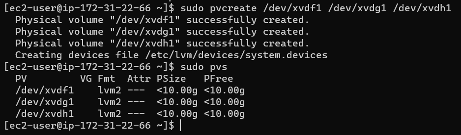
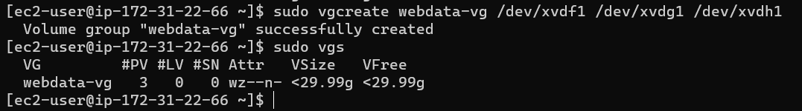
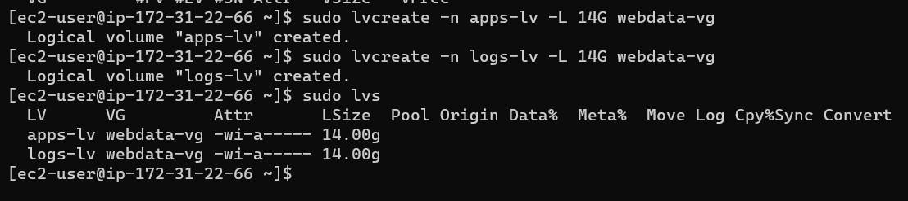
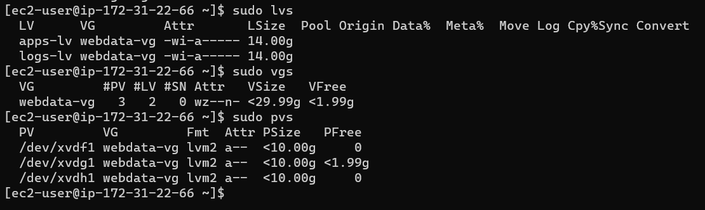
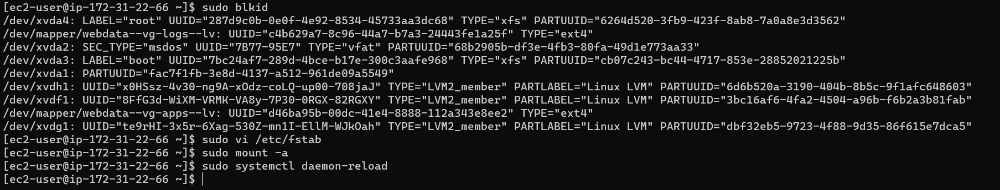
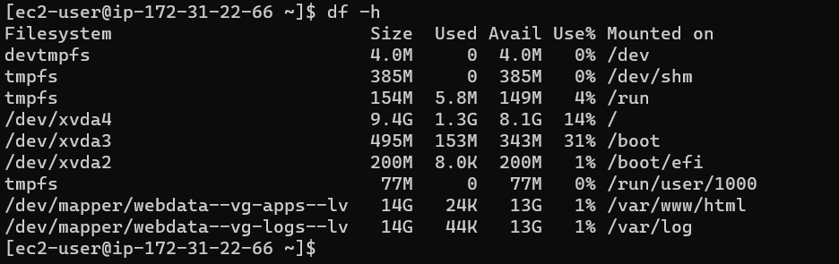

## Project Docs on Web Solution Implementation with Wordpress

### First spin up my EC2 Instances

I am using AWS cloud platform for my webserver and db        
Named teh first instance "web-sever" and the second "db-server"     
I ensured that both are on thesame availability zones

Created 3 volumes in the same AZ as my Web Server EC2, each of 10 GB and attached all to "web-server" EC2 instace.      
Connect to my instance on powershell and test for volume availability on the server using the cmd `lsblk`     
      
All devices in Linux reside in /dev/ directory      

Used `gdisk` utility to create a single partition on each of the 3 disks            
`sudo gdisk /dev/xvdf`  and follow the command prompts as shown below to create the first volume partition.     
      
Repeat same process for the remainig volumes and use `lsblk` to check if the were properly created      
        
I installed lvm2 package using `sudo yum install lvm2`. and afterwards run `sudo lvmdiskscan` command to check for available partitions.        
       

Then used `pvcreate` utility to mark each of 3 disks as physical volumes (PVs) to be used by LVM and the use `sudo pvs` to confirm creation     
          

Used `vgcreate` utility to add all 3 PVs to a volume group (VG) names **webdata-vg**
`sudo vgcreate webdata-vg /dev/xvdh1 /dev/xvdg1 /dev/xvdf1`

Verified that the VG has been created successfully by running `sudo vgs`        
      

Using `lvcreate` utility to create 2 logical volumes.   
`apps-lv` splitting the size of the volume into 2 as apps-lv will be used to store data for the Website while, logs-lv will be used to store data for logs.     
`sudo lvcreate -n apps-lv -L 14G webdata-vg`        
`sudo lvcreate -n logs-lv -L 14G webdata-vg`

Verified the Logical Volumes with `sudo lvs`        
      

To verify the entire setup      
`sudo vgdisplay -v #view complete setup - VG, PV, and LV`
`sudo lsblk`
        

Make file systems `mkfs.ext4` to format the logical volumes with ext4 filesystem        
`sudo mkfs -t ext4 /dev/webdata-vg/apps-lv`     
`sudo mkfs -t ext4 /dev/webdata-vg/logs-lv`

Created /var/www/html directory to store website files      
`sudo mkdir -p /var/www/html`       

Created /home/recovery/logs to store backup of log data     
`sudo mkdir -p /home/recovery/logs`     

Then mounted /var/www/html on **apps-lv logical volume**        
`sudo mount /dev/webdata-vg/apps-lv /var/www/html/`         
Used `rsync` utility to backup all the files in the log directory       
`/var/log into /home/recovery/logs` (This was required before mounting the file system)     
`sudo rsync -av /var/log/. /home/recovery/logs/`

Mounted `/var/log on logs-lv logical volume`. (Note that all the existing data on /var/log will be deleted. That is why step 15 above is very important)        
`sudo mount /dev/webdata-vg/logs-lv /var/log`       

Then restore log files back into /var/log directory         
`sudo rsync -av /home/recovery/logs/log/. /var/log`     

For the mount configuration to persist after restart of the server, update the /etc/fstab file.     
The UUID of the device will be used to update the /etc/fstab file;      
`sudo blkid`        
`sudo vi /etc/fstab` and update the fstab using the UUID's of both the web and log      
Then test the configuration and reload the daemon:      
`sudo mount -a`     
`sudo systemctl daemon-reload`      
      

To verify my setup using df -h, output looked like this:        
      

